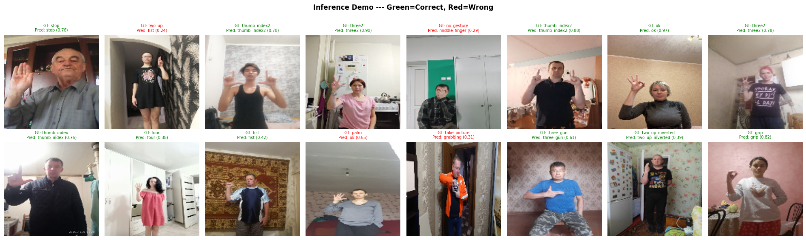

# HaGRID Hand Gesture Recognition

Real-time hand gesture classification using **EfficientNet-B0** trained on the [HaGRID](https://huggingface.co/datasets/GestureDetectionConnoisseurs/hagrid_subsets) dataset.  
The dataset is served through HuggingFace — no Kaggle account or SberCloud access required.

[](https://www.python.org/)
[](https://github.com/huggingface/pytorch-image-models)
[](https://huggingface.co/datasets/GestureDetectionConnoisseurs/hagrid_subsets)
[](https://huggingface.co/timm/efficientnet_b0.ra_in1k)
[](LICENSE)

---

## Overview

| File | Purpose |
|---|---|
| `EDA_HaGRID.ipynb` | Download dataset, explore annotations, visualise class & bbox distributions |
| `TRAINING_HaGRID.ipynb` | Fine-tune EfficientNet-B0 for 34-class gesture classification |
| `demo_hagrid.py` | Real-time webcam inference with a styled HUD overlay |

**Supported gestures (34 classes — HaGRIDv2)**

`call` · `dislike` · `fist` · `four` · `grabbing` · `grip` · `hand_heart` · `hand_heart2` · `holy` · `like` · `little_finger` · `middle_finger` · `mute` · `no_gesture` · `ok` · `one` · `palm` · `peace` · `peace_inverted` · `point` · `rock` · `stop` · `stop_inverted` · `take_picture` · `three` · `three2` · `three3` · `three_gun` · `thumb_index` · `thumb_index2` · `timeout` · `two_up` · `two_up_inverted` · `xsign`

---

## Prerequisites

- Python 3.12.3
- A CUDA-capable GPU is **strongly recommended** for training (CPU works but is slow)
- Webcam for the live demo

---

## Installation

```bash
git clone https://github.com/GTRe5/Hagrid-Gesture-Recognition.git
cd Hagrid-Gesture-Recognition

pip install -r requirements.txt
```

> **Google Colab users:** the notebooks install their own dependencies via `!pip install` cells — just open and run.

---

## Workflow

### Step 1 — Exploratory Data Analysis

Open **`EDA_HaGRID.ipynb`** in Colab or Jupyter.

The notebook will:

1. Download a pre-packaged subset zip directly from HuggingFace.
2. Extract images and annotation JSONs into a structured directory tree.
3. Parse annotations into a flat DataFrame (one row per bounding box).
4. Assign stratified 80 / 10 / 10 train/val/test splits by gesture class.
5. Produce EDA plots covering class distribution, bounding-box statistics, leading-hand breakdown, and per-subject sample counts.
6. Save a summary dashboard and output CSVs to `hagrid_outputs/`.

**Choose your subset size** by editing the `IMAGES_PER_CLASS` variable before running:

| Value | Zip file | Approx. size |
|---|---|---|
| `5` | `hagrid-export_5_images.zip` | 20 MB |
| `100` | `hagrid-export_100_images.zip` | 402 MB |
| `500` | `hagrid-export_500_images.zip` | 2.0 GB |
| `1000` | `hagrid-export_1000_images.zip` | 4.1 GB |
| `2000` | `hagrid-export_2000_images.zip` | 8.1 GB |

```python
# Section 2 of EDA_HaGRID.ipynb
IMAGES_PER_CLASS = 100   # ← change this
```

---

### Step 2 — Training

Open **`TRAINING_HaGRID.ipynb`** in Colab (a T4 GPU is sufficient).

Key configuration options are all in **Section 2**:

```python
MODEL_NAME     = 'efficientnet_b0'
IMG_SIZE       = 224
BATCH_SIZE     = 64
NUM_EPOCHS     = 100
LR             = 3e-4
WEIGHT_DECAY   = 1e-4
PATIENCE       = 8          # early-stopping patience (epochs)
FREEZE_BASE    = True       # freeze backbone for first UNFREEZE_EPOCH epochs
UNFREEZE_EPOCH = 3          # epoch at which full fine-tuning begins
```

**Training strategy**

- Epochs 1–2: backbone is frozen; only the classifier head is trained so it can stabilise before gradients touch the pretrained weights.
- Epoch 3+: full fine-tuning with the backbone LR set 10× lower to preserve learned features.
- Loss: `CrossEntropyLoss` with label smoothing 0.1 (helps with visually similar classes like `three` / `three2` / `three3`).
- Optimiser: `AdamW`
- Scheduler: `CosineAnnealingWarmRestarts` (T₀ = 5, T_mult = 2)

**Google Drive caching (Section 3)**

The notebook caches the resized numpy arrays to your Drive so re-runs skip the slow decoding step:

```
/content/drive/MyDrive/hagrid_dataset/hagrid_500_cache.npz
```

**Outputs saved per run**

```
hagrid_checkpoints/
    efficientnet_b0_hagrid_best.pth      ← best val-accuracy checkpoint
    efficientnet_b0_hagrid_final.pth     ← final epoch checkpoint

hagrid_outputs/
    plots/
        sample_batch.png
        training_curves.png
        confusion_matrix.png
        per_class_f1.png
    metrics/
        training_log.json
        classification_report.json
```

## Results

### Inference Demo

Sample predictions on the test set — **green** = correct, **red** = wrong.



> Most misclassifications occur on visually similar gestures (e.g. `palm` → `ok`, `two_up` → `fist`),
> which is expected given their overlapping hand shapes.

---

### Step 3 — Live Demo

After training, run the webcam demo locally:

```bash
python demo_hagrid.py
```

**Common options**

```bash
# Use a non-default checkpoint path
python demo_hagrid.py --ckpt path/to/efficientnet_b0_hagrid_final.pth

# Use a second camera, lower threshold, show top-5 predictions
python demo_hagrid.py --cam 1 --threshold 0.6 --topk 5

# Set capture resolution
python demo_hagrid.py --width 1280 --height 720
```

**All CLI arguments**

| Argument | Default | Description |
|---|---|---|
| `--ckpt` | `hagrid_checkpoints/efficientnet_b0_hagrid_final.pth` | Path to `.pth` checkpoint |
| `--cam` | `0` | Camera device index |
| `--threshold` | `0.50` | Minimum confidence to display a label |
| `--topk` | `3` | Number of top predictions shown in the side panel |
| `--width` | `640` | Capture width in pixels |
| `--height` | `480` | Capture height in pixels |

**Controls while the window is open**

| Key / Action | Effect |
|---|---|
| `Q` or `Esc` | Quit |
| `S` | Save screenshot (`hagrid_screenshot_<timestamp>.png`) |
| Click **[Q] QUIT** button | Quit |

---

## Project Structure

```
Hagrid-Gesture-Recognition/
├── EDA_HaGRID.ipynb                 # Data exploration notebook
├── TRAINING_HaGRID.ipynb            # Model training notebook
├── demo_hagrid.py                   # Real-time webcam demo
├── requirements.txt
├── about.txt
├── dataset.txt
├── README.md
│
├── hagrid_checkpoints/              # Created during training
│   ├── efficientnet_b0_hagrid_best.pth
│   └── efficientnet_b0_hagrid_final.pth
│
└── hagrid_outputs/                  # Created during EDA & training
    ├── plots/
    └── metrics/
```

---

## Dataset

**[GestureDetectionConnoisseurs/hagrid_subsets](https://huggingface.co/datasets/GestureDetectionConnoisseurs/hagrid_subsets)**  
A pre-packaged, class-balanced subset of the original [HaGRIDv2](https://github.com/hukenovs/hagrid) dataset hosted on HuggingFace.

The annotation JSON schema used in the EDA notebook:

| Field | Type | Description |
|---|---|---|
| `img_id` | `str` | Unique image UUID |
| `gesture_class` | `str` | Folder / top-level class (e.g. `call`) |
| `label` | `str` | Per-bounding-box gesture label |
| `bbox_x/y/w/h` | `float` | Normalised bounding box coordinates `[0, 1]` |
| `bbox_area` | `float` | `bbox_w × bbox_h` |
| `aspect_ratio` | `float` | `bbox_w / bbox_h` |
| `leading_hand` | `str` | `right` \| `left` |
| `leading_conf` | `float` | Hand-dominance prediction confidence |
| `user_id` | `str` | Anonymous subject ID |
| `split` | `str` | `train` \| `val` \| `test` |

---

## Requirements

See [`requirements.txt`](requirements.txt) for the full list.  
Core dependencies: `torch`, `torchvision`, `timm`, `datasets`, `huggingface_hub`, `opencv-python`, `scikit-learn`, `pandas`, `matplotlib`, `seaborn`.

> ONNX export packages (`onnx`, `onnxruntime`, `onnxscript`) are optional and only needed for the model export cell in Section 10 of the training notebook.

---

## License

This project is released under the [MIT License](LICENSE).  
The HaGRID dataset is subject to its own license — see the [original repository](https://github.com/hukenovs/hagrid) for details.